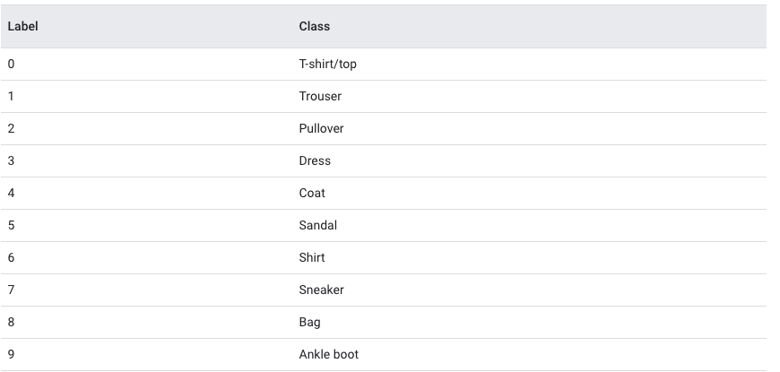

# Basic classification: Classify images of clothing

## Framework / Tool
- TensorFlow and tf.keras

## Installation
https://www.tensorflow.org/install/pip

## ML with Keras
- Keras is a Sequential model
- A Sequential model is appropriate for a plain stack of layers where each layer has exactly one input tensor and one output tensor.

## Labels

## Refrences
- https://www.tensorflow.org/tutorials/keras/classification
